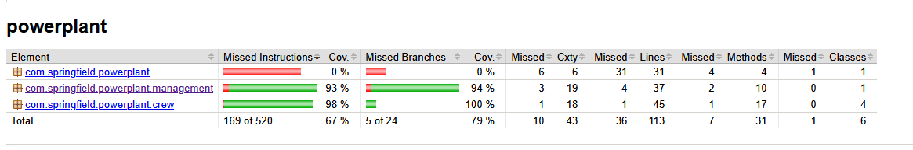

# SPRINGFIELD POWERPLANT
MANUEL MARCELO SÁNCHEZ SALGADO — EXÁMEN TERCERA EVALUACIÓN CONTORNOS + PROGRAMACIÓN 1ºDAM 2024-2025 IES TEIS. 

Programa que simula el funcionamiento de una aplicación de servicio extendible, en la actualidad siendo capaz de analizar a los empleados que trabajan para la empesa.

## Paquetes
``crew`` - Contiene a la clase Employee, así como sus enum ``Departament``, ``ExperienceLevel`` y ``Shift``. No cuenta con lógica.
``management`` - contiene la interfaz ``EmployeeManagementService`` y su implementación ``EmployeeManagementServiceImpl``:
- Es capaz de crear y modificar empleados.
- Guarda a los empleados creados satisfactoriamente en una base de datos.
- Realiza operaciones CRUD sobre la base de datos.

## Coverage
La lógica del programa cuenta con un coverage entorno al 95%. El POM cuenta con Jacoco y los test se incluyen en el repositorio.

